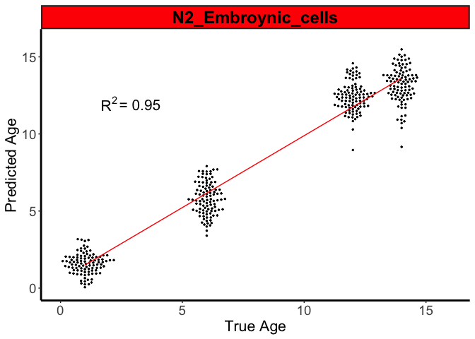
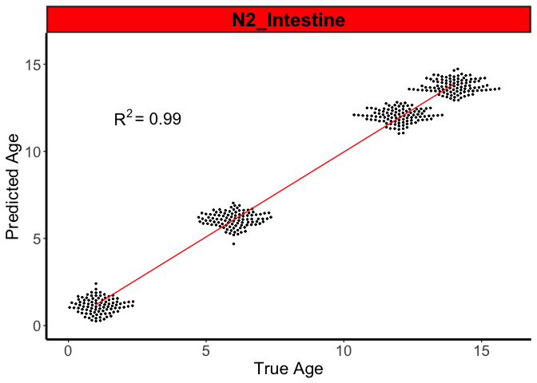
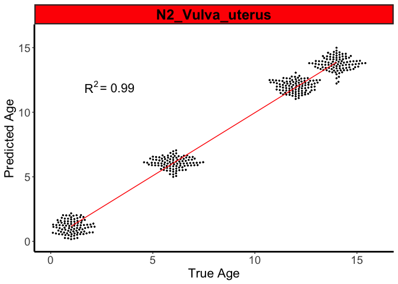

Transcriptomic Aging Atlas
================
Aaron Mohammed

## Bootstrapping

``` r
# Extract the names of the tissues and store them in a vector
Idents(seurat_data)<-"tissue"
tissuez <- names(table(seurat_data[[]]$tissue))
tissuez
```

    ##  [1] "Coelomocyte"                  "Embroynic_cells"             
    ##  [3] "Excretory_gland_cell_and_dtc" "Germline"                    
    ##  [5] "Glia"                         "Gonadal_sheath_cells"        
    ##  [7] "Hypodermis"                   "Intestine"                   
    ##  [9] "Muscle"                       "Neuron"                      
    ## [11] "Pharynx"                      "Spermatheca"                 
    ## [13] "Sperms"                       "Uterine_seam_cell"           
    ## [15] "Vulva_uterus"

For each tissue of each genotype of each day, 15 cells were randomly
sampled and the counts associated with each of the 26208 genes were
aggregated. This was done 101 times and each result was stored as a
column in a matrix, where each row was a gene. I used the sample()
function which used the Mersenne-Twister method for random number
generation, the default method used by version of R that I was using at
the time (4.2.1). The cells were sampled without replacement.

``` r
# Bootsrapping function that takes a character vector of tissue names as input

bootstrap.cells <- function (tissue) {

  # Create a folder for each tissue
  dir.create(file.path(bootstrap_path,tissue))
  tissue_path <- file.path(bootstrap_path, tissue)
  
  # Subset the tissue 
  Idents(seurat_data)<-"tissue"
  subset(seurat_data,idents = tissue)->tissue_subset
  Idents(tissue_subset)<-"orig.ident"
  
  ##############################################################################
  ################################ Wild Type ###################################
  ##############################################################################
  
  #### N2 Day 1 ####
  
  # Subset day 1 data for N2
  tmp <- subset(tissue_subset, idents =c("N2D1","N2D1R","N2OPD1"))
  
  # Extract count data from the N2 day 1 subset
  counts <- tmp@assays$RNA@counts 
  metadata <- tmp@meta.data
  sce <- SingleCellExperiment(assays = list(counts = counts), 
                              colData = metadata)
  cells <- colData(sce)[, c("genotype")]
  
  # Only evaluate if there are at least 50 cells
  if (length(cells) >= 50) { 
    
    # Create a character vector that will be used for labeling cells
    # This vector has the same length as the number of cells
    labels <- rep('neg',length(cells))
    
    # Randomly change 15 labels in the vector from neg to pos
    'pos' -> labels[sample(c(1:length(cells)),size=15, replace=FALSE)]
    
    # Aggregate the count matrix according to the labels
    sam <- Matrix.utils:::aggregate.Matrix(t(counts(sce)), 
                           groupings = labels, fun = "sum") 
    
    # Extract the aggregated counts for the cells that were labeled as pos and
    # store in a data frame called Day
    Day <- data.frame(sam=sam['pos',])
    
    for (i in 1:100){ 
      
      # Repeat the same steps 100 more times and each time append the result to
      # the Day data frame
      labels <- rep('neg',length(cells))
      'pos' -> labels[sample(c(1:length(cells)),size=15, replace=FALSE)]
      sam <- Matrix.utils:::aggregate.Matrix(t(counts(sce)), 
                             groupings = labels, fun = "sum") 
      Day <- cbind(Day,sam['pos',])
      
    }
    
    # Save the Day data frame as a csv file in the tissue directory
    write.csv(Day,file.path(tissue_path,"N2_Day_1.csv"))
    
  }
  
  #### N2 Day 6 ###
  
  # Subset day 6 data for N2
  tmp <- subset(tissue_subset,idents =c("N2D6"))
  
  # Extract count data from the N2 day 6 subset
  counts <- tmp@assays$RNA@counts 
  metadata <- tmp@meta.data
  sce <- SingleCellExperiment(assays = list(counts = counts), 
                              colData = metadata)
  cells <- colData(sce)[, c("genotype")]
  
  # Only evaluate if there are at least 50 cells
  if (length(cells) >= 50) { 
    
    # Create a character vector that will be used for labeling cells
    # This vector has the same length as the number of cells
    labels <- rep('neg',length(cells))
    
    # Randomly change 15 labels in the vector from neg to pos
    'pos' -> labels[sample(c(1:length(cells)),size=15, replace=FALSE)]
    
    # Aggregate the count matrix according to the labels
    sam <- Matrix.utils:::aggregate.Matrix(t(counts(sce)), 
                           groupings = labels, fun = "sum") 
    
    # Extract the aggregated counts for the cells that were labeled as pos and
    # store in a data frame called Day
    Day <- data.frame(sam=sam['pos',])
    
    for (i in 1:100){ 
      
      # Repeat the same steps 100 more times and each time append the result to
      # the Day data frame
      labels <- rep('neg',length(cells))
      'pos' -> labels[sample(c(1:length(cells)),size=15, replace=FALSE)]
      sam <- Matrix.utils:::aggregate.Matrix(t(counts(sce)), 
                             groupings = labels, fun = "sum") 
      Day <- cbind(Day,sam['pos',])
      
    }
    
    # Save the Day data frame as a csv file in the tissue directory
    write.csv(Day,file.path(tissue_path,"N2_Day_6.csv"))
    
  }
  
  ### N2 Day 12 ###
  
  # Subset day 12 data for N2
  tmp <- subset(tissue_subset,idents =c("N2D12"))
  
  # Extract count data from the N2 day 12 subset
  counts <- tmp@assays$RNA@counts 
  metadata <- tmp@meta.data
  sce <- SingleCellExperiment(assays = list(counts = counts), 
                              colData = metadata)
  cells <- colData(sce)[, c("genotype")]
  
  # Only evaluate if there are at least 50 cells
  if (length(cells) >= 50) { 
    
    # Create a character vector that will be used for labeling cells
    # This vector has the same length as the number of cells
    labels <- rep('neg',length(cells))
    
    # Randomly change 15 labels in the vector from neg to pos
    'pos' -> labels[sample(c(1:length(cells)),size=15, replace=FALSE)]
    
    # Aggregate the count matrix according to the labels
    sam <- Matrix.utils:::aggregate.Matrix(t(counts(sce)), 
                           groupings = labels, fun = "sum") 
    
    # Extract the aggregated counts for the cells that were labeled as pos and
    # store in a data frame called Day
    Day <- data.frame(sam=sam['pos',])
    
    for (i in 1:100){ 
      
      # Repeat the same steps 100 more times and each time append the result to
      # the Day data frame
      labels <- rep('neg',length(cells))
      'pos' -> labels[sample(c(1:length(cells)),size=15, replace=FALSE)]
      sam <- Matrix.utils:::aggregate.Matrix(t(counts(sce)), 
                             groupings = labels, fun = "sum") 
      Day <- cbind(Day,sam['pos',])
      
    }
    
    # Save the Day data frame as a csv file in the tissue directory
    write.csv(Day,file.path(tissue_path,"N2_Day_12.csv"))
    
  }
  
  ### N2 Day 14 ###
  
  # Subset day 14 data for N2
  tmp <- subset(tissue_subset,idents =c("N2D14"))
  
  # Extract count data from the N2 day 14 subset
  counts <- tmp@assays$RNA@counts 
  metadata <- tmp@meta.data
  sce <- SingleCellExperiment(assays = list(counts = counts), 
                              colData = metadata)
  cells <- colData(sce)[, c("genotype")]
  
  # Only evaluate if there are at least 50 cells
  if (length(cells) >= 50) { 
    
    # Create a character vector that will be used for labeling cells
    # This vector has the same length as the number of cells
    labels <- rep('neg',length(cells))
    
    # Randomly change 15 labels in the vector from neg to pos
    'pos' -> labels[sample(c(1:length(cells)),size=15, replace=FALSE)]
    
    # Aggregate the count matrix according to the labels
    sam <- Matrix.utils:::aggregate.Matrix(t(counts(sce)), 
                           groupings = labels, fun = "sum") 
    
    # Extract the aggregated counts for the cells that were labeled as pos and
    # store in a data frame called Day
    Day <- data.frame(sam=sam['pos',])
    
    for (i in 1:100){ 
      
      # Repeat the same steps 100 more times and each time append the result to
      # the Day data frame
      labels <- rep('neg',length(cells))
      'pos' -> labels[sample(c(1:length(cells)),size=15, replace=FALSE)]
      sam <- Matrix.utils:::aggregate.Matrix(t(counts(sce)), 
                             groupings = labels, fun = "sum") 
      Day <- cbind(Day,sam['pos',])
      
    }
    
    # Save the Day data frame as a csv file in the tissue directory
    write.csv(Day,file.path(tissue_path,"N2_Day_14.csv"))
    
  }
  
  
  ##############################################################################
  ########################### Longevity Genotypes ##############################
  ##############################################################################
  
  ################################# lipl-4 Tg ##################################
  
  ### LIPL4 Day 6 ###
  
  # Subset day 6 data for LIPL4
  tmp <- subset(tissue_subset,idents =c("LIPL4D6"))
  
  # Extract count data from the LIPL4 day 6 subset
  counts <- tmp@assays$RNA@counts 
  metadata <- tmp@meta.data
  sce <- SingleCellExperiment(assays = list(counts = counts), 
                              colData = metadata)
  cells <- colData(sce)[, c("genotype")]
  
  # Only evaluate if there are at least 50 cells
  if (length(cells) >= 50) { 
    
    # Create a character vector that will be used for labeling cells
    # This vector has the same length as the number of cells
    labels <- rep('neg',length(cells))
    
    # Randomly change 15 labels in the vector from neg to pos
    'pos' -> labels[sample(c(1:length(cells)),size=15, replace=FALSE)]
    
    # Aggregate the count matrix according to the labels
    sam <- Matrix.utils:::aggregate.Matrix(t(counts(sce)), 
                           groupings = labels, fun = "sum") 
    
    # Extract the aggregated counts for the cells that were labeled as pos and
    # store in a data frame called Day
    Day <- data.frame(sam=sam['pos',])
    
    for (i in 1:100){ 
      
      # Repeat the same steps 100 more times and each time append the result to
      # the Day data frame
      labels <- rep('neg',length(cells))
      'pos' -> labels[sample(c(1:length(cells)),size=15, replace=FALSE)]
      sam <- Matrix.utils:::aggregate.Matrix(t(counts(sce)), 
                             groupings = labels, fun = "sum") 
      Day <- cbind(Day,sam['pos',])
      
    }
    
    # Save the Day data frame as a csv file in the tissue directory
    write.csv(Day,file.path(tissue_path,"LIPL4_Day_6.csv"))
    
  }
  
  ################################# daf-2(lf) ##################################
  
  ### DAF2 Day 6 ###
  
  # Subset day 6 data for DAF2
  tmp <- subset(tissue_subset,idents =c("DAF2D6"))
  
  # Extract count data from the DAF2 day 6 subset
  counts <- tmp@assays$RNA@counts 
  metadata <- tmp@meta.data
  sce <- SingleCellExperiment(assays = list(counts = counts), 
                              colData = metadata)
  cells <- colData(sce)[, c("genotype")]
  
  # Only evaluate if there are at least 50 cells
  if (length(cells) >= 50) { 
    
    # Create a character vector that will be used for labeling cells
    # This vector has the same length as the number of cells
    labels <- rep('neg',length(cells))
    
    # Randomly change 15 labels in the vector from neg to pos
    'pos' -> labels[sample(c(1:length(cells)),size=15, replace=FALSE)]
    
    # Aggregate the count matrix according to the labels
    sam <- Matrix.utils:::aggregate.Matrix(t(counts(sce)), 
                           groupings = labels, fun = "sum") 
    
    # Extract the aggregated counts for the cells that were labeled as pos and
    # store in a data frame called Day
    Day <- data.frame(sam=sam['pos',])
    
    for (i in 1:100){ 
      
      # Repeat the same steps 100 more times and each time append the result to
      # the Day data frame
      labels <- rep('neg',length(cells))
      'pos' -> labels[sample(c(1:length(cells)),size=15, replace=FALSE)]
      sam <- Matrix.utils:::aggregate.Matrix(t(counts(sce)), 
                             groupings = labels, fun = "sum") 
      Day <- cbind(Day,sam['pos',])
      
    }
    
    # Save the Day data frame as a csv file in the tissue directory
    write.csv(Day,file.path(tissue_path,"DAF2_Day_6.csv"))
    
  }
  
  ################################# rsks-1(lf) #################################
  
  ### RSKS1 Day 6 ###
  
  # Subset day 6 data for RSKS1
  tmp <- subset(tissue_subset,idents =c("RSKS1D6"))
  
  # Extract count data from the RSKS1 day 6 subset
  counts <- tmp@assays$RNA@counts 
  metadata <- tmp@meta.data
  sce <- SingleCellExperiment(assays = list(counts = counts), 
                              colData = metadata)
  cells <- colData(sce)[, c("genotype")]
  
  # Only evaluate if there are at least 50 cells
  if (length(cells) >= 50) { 
    
    # Create a character vector that will be used for labeling cells
    # This vector has the same length as the number of cells
    labels <- rep('neg',length(cells))
    
    # Randomly change 15 labels in the vector from neg to pos
    'pos' -> labels[sample(c(1:length(cells)),size=15, replace=FALSE)]
    
    # Aggregate the count matrix according to the labels
    sam <- Matrix.utils:::aggregate.Matrix(t(counts(sce)), 
                           groupings = labels, fun = "sum") 
    
    # Extract the aggregated counts for the cells that were labeled as pos and
    # store in a data frame called Day
    Day <- data.frame(sam=sam['pos',])
    
    for (i in 1:100){ 
      
      # Repeat the same steps 100 more times and each time append the result to
      # the Day data frame
      labels <- rep('neg',length(cells))
      'pos' -> labels[sample(c(1:length(cells)),size=15, replace=FALSE)]
      sam <- Matrix.utils:::aggregate.Matrix(t(counts(sce)), 
                             groupings = labels, fun = "sum") 
      Day <- cbind(Day,sam['pos',])
      
    }
    
    # Save the Day data frame as a csv file in the tissue directory
    write.csv(Day,file.path(tissue_path,"RSKS1_Day_6.csv"))
    
  }

}
```

``` r
# Run the bootstrap function
for(i in 1:length(tissuez)) {
bootstrap.cells(tissuez[i])
}
```

``` r
# Here is an example of what one of the data frames looks like. What's displayed
# is the first 10 genes and first 5 columns of aggregated counts. Each data 
# frame has 26208 rows and 101 columns
N2_day_1 <- read.csv(file.path(tissue_path, "N2_Day_1.csv"), row.names = 1)
N2_day_1[1:10, 1:5]
```

    ##        sam sam..pos.... sam..pos.....1 sam..pos.....2 sam..pos.....3
    ## nduo-6  13           13              3              7             13
    ## ndfl-4   3            3              0              0              7
    ## MTCE.7   3            5              1              3             11
    ## nduo-1   6            4              0              0             10
    ## atp-6   13           15              8             13             32
    ## nduo-2   7            1              3              0              4
    ## ctb-1    1            9              3              4             20
    ## ctc-3   15           12              4              8             54
    ## nduo-4   4            4              1              5              7
    ## ctc-1   26           16             17             19             68

``` r
# Not of the tissues contained all time points for N2. The ones that did have
# day 1, day 6, day 12, day 14 data were copied to a new directory using a 
# function I wrote called filter.by.N2

# Create a directory where the files for the tissues with all 4 time points for 
# N2 will be copied to 
all_timepoints_dir <- file.path(bootstrap_path,c("tissues_with_all_N2_timepoints"))
dir.create(all_timepoints_dir)
```

    ## Warning in dir.create(all_timepoints_dir):
    ## '/Users/asm/Documents/git_for_jobs/bootstrap/tissues_with_all_N2_timepoints'
    ## already exists

``` r
# Filtering function
filter.by.N2 <- function (tissue) {
  
  # List the files in that contain 'N2' in their name within the tissue 
  # directory being evaluated
  contents <- dir(file.path(bootstrap_path, tissue),pattern = "N2")
  
  # Determine the number of files that contain 'N2' in their name and store that
  # number in a variable called l 
  l <- length(contents)

  # If l is equal to 4, copy the tissue directory being evaluated to the
  # 'tissues_with_all_N2_timepoints' directory
  if (l == 4) {
    new_tissue_dir <- file.path(all_timepoints_dir,tissue)
    copyDirectory(file.path(bootstrap_path, tissue), new_tissue_dir)
  }
  
}
  
# Run the filtering function
for (i in 1:length(tissuez)) {
  filter.by.N2(tissuez[i])
}

# These were the tissues with all 4 time points for N2
tissuez <- list.dirs(all_timepoints_dir,full.names=FALSE, recursive= FALSE)
tissuez
```

    ## [1] "Embroynic_cells" "Germline"        "Hypodermis"      "Intestine"      
    ## [5] "Muscle"          "Neuron"          "Pharynx"         "Vulva_uterus"

## Machine Learning

In this section, the counts data from all 4 wild type (N2) time points
were used to create age-prediction models or ‘aging clocks’ for each
tissue. Those models were then used to predict the age of each of the
longevity genotypes on day 6.

``` r
predictions_dir <- file.path(main_path, "Predictions_using_wild_type_models")
dir.create(predictions_dir)
```

Before predicting the age of the longevity genotypes, I used the
age-prediction models to predict the age of the wild type genotype for
each tissue. The coefficient of determination, R2 should have a value of
1 for each tissue. In other words, the predicted age of N2 day 6 should
be 6 days.

``` r
predict.N2 <- function(tissue) {
  
  tissue_dir <- file.path(all_timepoints_dir, tissue)
  output_dir <- file.path(predictions_dir, tissue)
  dir.create(output_dir)
  
  ################################# N2 Model ##################################
  
  read.csv(file.path(tissue_dir,'N2_Day_1.csv')) -> day1
  read.csv(file.path(tissue_dir,'N2_Day_6.csv')) -> day6
  read.csv(file.path(tissue_dir,'N2_Day_12.csv')) -> day12
  read.csv(file.path(tissue_dir,'N2_Day_14.csv')) -> day14
  
  rownames(day1) <- day1$X
  rownames(day6) <- day6$X
  rownames(day12) <- day12$X
  rownames(day14) <- day14$X
  
  day1[2:102]->day1
  day6[2:102]->day6
  day12[2:102]->day12
  day14[2:102]->day14
  
  all <- cbind(day1,day6,day12,day14)
  expression <- log(t(all)*100000/colSums(all))
  t(t(c(rep(1,101),rep(6,101),rep(12,101),rep(14,101))))->true_age
  
  cvfit <- cv.glmnet(expression, true_age)
  R2_N2 <- cvfit$glmnet.fit$dev.ratio[cvfit$index[1]] #R2
  write.csv(R2_N2,file.path(output_dir, "R2_N2.csv"))
  saveRDS(cvfit,file.path(output_dir, "model_N2.RDS"))
  
  # Gene coefficients 
  coef(cvfit,s = "lambda.min")-> coefout
  coefout[,1]->test2
  data.frame(test2)->test3
  data.frame(gene=rownames(day1),value=test3[2:nrow(test3),])-> out
  write.csv(out, file.path(output_dir, "gene_coef_N2.csv"))
  
  # Prediction
  predict(cvfit, newx = expression,s = "lambda.min") -> predicted_age
  cbind(predicted_age,true_age)->predictionout
  write.csv(predictionout, file.path(output_dir, "pred_N2.csv"))
  
  
  # Plot N2
  read.csv(file.path(output_dir, 'pred_N2.csv')) -> predictions
  R2_for_ggplot <- paste(c("="), sep=" ", round(R2_N2, digits = 2))
  predictions$title <- paste(c("N2"), sep="_", tissue)
  
  plot <- ggplot(predictions, aes(X.1, lambda.min)) +
    geom_beeswarm(width = 0.6, height = 0.8, size= 0.5) + 
    xlab(c("True Age")) + 
    ylab(c("Predicted Age")) +
    theme_bw() + 
    theme(panel.border = element_blank(), 
          panel.grid.major = element_blank(), panel.grid.minor = element_blank(), 
          axis.line = element_line(colour = "black", size = 1), 
          axis.text=element_text(size=14), axis.title=element_text(size=16), 
          title=element_text(size=20), plot.title= element_text(hjust = 0.5)) +
    geom_smooth(method=lm,se=FALSE, size= 0.5, col= 'red') + 
    annotate("text", x = 2, y = 12, label = expression(R^2), size= 5.5) + 
    annotate("text", x = 3.26, y = 11.9, label = R2_for_ggplot, size= 5.5) + 
    facet_grid(. ~ title) + 
    theme(strip.background = element_rect(fill="red", size= 1.5), 
          strip.text = element_text(size=18, face="bold", colour="black")) +
    xlim(0,16) + 
    ylim(0,16)
  
  pdf(file.path(output_dir,"predicted_ages_N2.pdf"))
  print(plot)
  dev.off()
  
  print(plot)
  
}
```

``` r
for (i in 1:length(tissuez)){
predict.N2(tissuez[i])
}
```

<!-- --><!-- --><!-- --><!-- --><!-- --><!-- --><!-- --><!-- -->

After determining the aging clocks were accurate at predicting the true
age of the wild type genotype for each tissue, they were used to predict
the age of each of the longevity genotypes for each tissue.

``` r
age.prediction <- function (tissue) {

  tissue_dir <- file.path(all_timepoints_dir, tissue)
  output_dir <- file.path(predictions_dir, tissue)
  dir.create(output_dir)

  ################################# N2 Model ##################################

  read.csv(file.path(tissue_dir,'N2_Day_1.csv')) -> day1
  read.csv(file.path(tissue_dir,'N2_Day_6.csv')) -> day6
  read.csv(file.path(tissue_dir,'N2_Day_12.csv')) -> day12
  read.csv(file.path(tissue_dir,'N2_Day_14.csv')) -> day14

  rownames(day1) <- day1$X
  rownames(day6) <- day6$X
  rownames(day12) <- day12$X
  rownames(day14) <- day14$X

  day1[2:102]->day1
  day6[2:102]->day6
  day12[2:102]->day12
  day14[2:102]->day14

  all <- cbind(day1,day6,day12,day14)
  expression <- log(t(all)*100000/colSums(all))
  true_age <- t(t(c(rep(1,101),rep(6,101),rep(12,101),rep(14,101))))

  cvfit_N2 <- cv.glmnet(expression, true_age)

  # LIPL4
  read.csv(file.path(tissue_dir,'LIPL4_Day_6.csv'))->LIPL4_day6

  LIPL4_day6[2:102] -> LIPL4_day6

  expression <- log(t(LIPL4_day6)*100000/colSums(LIPL4_day6))
  predicted_age <- predict(cvfit_N2, newx = expression,s = "lambda.min")
  true_age <- t(t(c(rep(6,101))))
  predictionout <- cbind(predicted_age,true_age)
  write.csv(predictionout,file.path(output_dir, "pred_LIPL4_model_N2.csv"))

  # DAF2
  read.csv(file.path(tissue_dir,'DAF2_Day_6.csv'))->DAF2_day6

  DAF2_day6[2:102]->DAF2_day6

  expression <- log(t(DAF2_day6)*100000/colSums(DAF2_day6))
  predicted_age <- predict(cvfit_N2, newx = expression,s = "lambda.min")
  true_age <- t(t(c(rep(6,101))))
  predictionout <- cbind(predicted_age,true_age)
  write.csv(predictionout,file.path(output_dir, "pred_DAF2_model_N2.csv"))

  # RSKS1
  read.csv(file.path(tissue_dir,'RSKS1_Day_6.csv'))->RSKS1_day6

  RSKS1_day6[2:102]->RSKS1_day6

  expression <- log(t(RSKS1_day6)*100000/colSums(RSKS1_day6))
  predicted_age <- predict(cvfit_N2, newx = expression,s = "lambda.min")
  true_age <- t(t(c(rep(6,101))))
  predictionout <- cbind(predicted_age,true_age)
  write.csv(predictionout,file.path(output_dir, "pred_RSKS1_model_N2.csv"))

}
```

``` r
for (i in 1:length(tissuez)){
age.prediction(tissuez[i])
}
```

``` r
LIPL4_ <- data.frame(matrix(ncol = 3, nrow = length(tissuez)))

for (i in 1:length(tissuez)) {

  dir <- file.path(main_path, "Predictions_using_wild_type_models", tissuez[i])

  LIPL4_D6 <- read.csv(file.path(dir, "pred_LIPL4_model_N2.csv"))
  LIPL4_D6 <- LIPL4_D6[LIPL4_D6$lambda.min != Inf, ]
  LIPL4_D6 <- LIPL4_D6[LIPL4_D6$lambda.min != -Inf, ]
  LIPL4_D6 <- LIPL4_D6[LIPL4_D6$lambda.min > 0, ]
  LIPL4_stats <- t(as.data.frame(unclass(summary(LIPL4_D6$lambda.min))))
  LIPL4_[i, ] <- LIPL4_stats[ , c(2,3,5)]

}

rownames(LIPL4_) <- tissuez
colnames(LIPL4_) <- c('Q1','Median','Q3')

rownames(LIPL4_[order(LIPL4_$Median, decreasing = TRUE),]) -> ordered_names_for_LIPL4

# LIPL4
LIPL4 <- {}

for (i in 1:length(tissuez)) {

  dir <- file.path(main_path, "Predictions_using_wild_type_models", tissuez[i])

  LIPL4_D6 <- read.csv(file.path(dir, "pred_LIPL4_model_N2.csv"))
  LIPL4_D6 <- LIPL4_D6[LIPL4_D6$lambda.min != Inf, ]
  LIPL4_D6 <- LIPL4_D6[LIPL4_D6$lambda.min != -Inf, ]
  LIPL4_D6 <- LIPL4_D6[LIPL4_D6$lambda.min > 0, ]
  LIPL4_D6 <- as.data.frame(LIPL4_D6[,2])
  LIPL4_D6[,2] <- tissuez[i]
  colnames(LIPL4_D6) <- c('lambda.min','Tissue')

  LIPL4[[i]] <- LIPL4_D6

}

LIPL4 <- do.call(rbind, LIPL4)

LIPL4$Tissue <- factor(LIPL4$Tissue , levels=ordered_names_for_LIPL4)

LIPL4[,3] <- rep(c("LIPL4"),nrow(LIPL4))
colnames(LIPL4) <- c('lambda.min','Tissue','Genotype')

# DAF2
DAF2 <- {}

for (i in 1:length(tissuez)) {

  dir <- file.path(main_path, "Predictions_using_wild_type_models", tissuez[i])

  DAF2_D6 <- read.csv(file.path(dir, "pred_DAF2_model_N2.csv"))
  DAF2_D6 <- DAF2_D6[DAF2_D6$lambda.min != Inf, ]
  DAF2_D6 <- DAF2_D6[DAF2_D6$lambda.min != -Inf, ]
  DAF2_D6 <- DAF2_D6[DAF2_D6$lambda.min > 0, ]
  DAF2_D6 <- as.data.frame(DAF2_D6[,2])
  DAF2_D6[,2] <- tissuez[i]
  colnames(DAF2_D6) <- c('lambda.min','Tissue')

  DAF2[[i]] <- DAF2_D6
}

DAF2 <- do.call(rbind, DAF2)

DAF2$Tissue <- factor(DAF2$Tissue , levels=ordered_names_for_LIPL4)

DAF2[,3] <- rep(c("DAF2"),nrow(DAF2))
colnames(DAF2) <- c('lambda.min','Tissue','Genotype')

# RSKS1
RSKS1 <- {}

for (i in 1:length(tissuez)) {

  dir <- file.path(main_path, "Predictions_using_wild_type_models", tissuez[i])

  RSKS1_D6 <- read.csv(file.path(dir, "pred_RSKS1_model_N2.csv"))
  RSKS1_D6 <- RSKS1_D6[RSKS1_D6$lambda.min != Inf, ]
  RSKS1_D6 <- RSKS1_D6[RSKS1_D6$lambda.min != -Inf, ]
  RSKS1_D6 <- RSKS1_D6[RSKS1_D6$lambda.min > 0, ]
  RSKS1_D6 <- as.data.frame(RSKS1_D6[,2])
  RSKS1_D6[,2] <- tissuez[i]
  colnames(RSKS1_D6) <- c('lambda.min','Tissue')

  RSKS1[[i]] <- RSKS1_D6
}

RSKS1 <- do.call(rbind, RSKS1)

RSKS1$Tissue <- factor(RSKS1$Tissue , levels=ordered_names_for_LIPL4)

RSKS1[,3] <- rep(c("RSKS1"),nrow(RSKS1))
colnames(RSKS1) <- c('lambda.min','Tissue','Genotype')


# Plot

df_list <- list(LIPL4, DAF2, RSKS1)
all_genotypes <- Reduce(function(x, y) merge(x, y, all=TRUE, sort=FALSE), df_list)  

all_genotypes$Genotype <- factor(all_genotypes$Genotype , levels= c("LIPL4","DAF2","RSKS1"))

blue <- c('#0066CC')
orange <- c('#CC9900')
pink <- c('#990066')

palet <- c(blue,orange,pink)
my_colors <- usecol(palet)

All_genotypes_boxplot <- ggplot(all_genotypes, aes(x=lambda.min, y=Tissue))+
  geom_boxplot(coef=0, aes(fill = Genotype), outlier.size=0.2, outlier.alpha=0.5) + 
  geom_jitter(size=0.2, alpha=0.5) +
  geom_vline(xintercept = 6, linetype="solid", color = "red", size=0.5) +
  scale_fill_manual(values = my_colors) +
  scale_x_continuous(limits = c(0, 8), expand = c(0, 0), n.breaks=3) + 
  xlab(c('Age')) + 
  ggtitle(c('Predicted Age')) + 
  facet_grid( ~ Genotype) +
  theme_bw() + 
  theme(panel.border = element_blank(), 
        panel.grid.major = element_blank(), 
        panel.grid.minor = element_blank(), 
        axis.line = element_line(color = "black", size = 0.5), 
        axis.text=element_text(size=14, color="black"), 
        axis.title=element_text(size=20), 
        title=element_text(size=22), 
        plot.title= element_text(hjust = 0.5), 
        legend.text=element_text(size=rel(0.8)),
        legend.title=element_blank(), 
        legend.key.size= unit(0.7,'cm'),
        panel.spacing = unit(1, "lines"), 
        strip.background=element_blank(), 
        strip.text=element_blank())

pdf(file.path(main_path, "Predictions_using_wild_type_models", "predicted_ages.pdf"),height = 5, width = 8)
All_genotypes_boxplot  
dev.off()
```

``` r
All_genotypes_boxplot
```

<!-- -->
